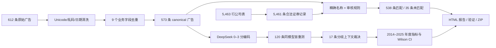

# 上市公司招聘广告中的 AI / 数字化技术含量

> 清华大学经济管理学院研究助理（RA）筛选任务完整交付
>
> 作者：翁广秦
>
> 仓库：[Patrickweng472/ra-task-ads-guangqinweng](https://github.com/Patrickweng472/ra-task-ads-guangqinweng)

本项目完整回答任务书中 Part 1–4 的 10 个必做问题，并完成 LLM API 编码、信度检验、稳健公司匹配、离线复现、自动测试、Git 过程追踪和可直接提交的压缩包。下文不只给出最终数字，还逐项说明了“为什么这样做——具体怎么做——得到什么结果——如何验证”。

## 一、最终答案摘要

| 任务 | 最终答案 |
|---|---|
| 原始广告行数 | **612 条** |
| 格式乱码处理 | 已清除所有 `<$&数字&$>` 标记，同时做 Unicode NFKC 和空白标准化 |
| 重复判定 | 除 `id` 外的 9 个清洗后原始业务字段完全相同 |
| 去重结果 | **612 → 573 条**，38 个重复组，移除 39 条 |
| 公司主表 | 5,463 行中保留 **5,461 条**合法证券记录，剔除 2 行脚注 |
| 公司匹配 | **538 条广告**匹配到 **378 家上市公司** |
| 未匹配 | **35 条**，均保留未匹配原因和候选记录 |
| AI / 数字化编码 | 573 条全部使用 DeepSeek V4 Pro 按 0–3 分正式编码 |
| 最终分数分布 | 0 分 310 条；1 分 205 条；2 分 56 条；严格 AI（3 分）2 条 |
| 年度主指标 | `score >= 2`，同时报告 `score >= 1` 和 `score == 3` |
| 稳定性检验 | 同一模型盲重测 120 条；精确一致率 85.8%；相邻一致率 100%；主阈值一致率 95.8%；二次加权 κ=0.893 |
| 分歧处理 | 17 条主编码/盲重测分歧已全部经上下文裁决 |
| 提示词演进 | v1→v2 有 93 条分数变化、31 条跨主阈值；v2→v2.1 formal 有 63 条变化、11 条跨主阈值；所有基线与对比均保留 |
| 最终交付 | [中文 HTML 报告](reports/ra_task_report.html)、[验证报告](verification_report.md)、[完整压缩包](dist/ra_task_submission.zip) |

## 二、数据、目录和数据血缘

本节说明项目从哪里读取数据、每类文件放在哪里，以及最终结果如何逐层追溯到原始输入。

### 2.1 原始数据

| 文件 | 内容 | 原始规模 |
|---|---|---:|
| [`data/raw/ra_task_ads.csv`](data/raw/ra_task_ads.csv) | 51job 招聘广告：公司、岗位、描述、标签、待遇、日期等 | 612 行 |
| [`data/raw/ra_task_firms.csv`](data/raw/ra_task_firms.csv) | 中国上市公司名单：证券代码、简称、全称、行业 | 5,463 行 |
| [`data/raw/RA_Task_README.md`](data/raw/RA_Task_README.md) | 原始任务书 | 1 份 |

原始 CSV 只作为输入，代码不就地修改它们。这样可以随时从原始数据重建所有中间与最终产出。

### 2.2 项目目录

```text
.
├── config/
│   ├── ai_rubric.yaml                 # 0–3 分量表
│   └── company_aliases.csv            # 已审核母公司/曾用名规则
├── data/
│   ├── raw/                            # 不改写的原始数据
│   ├── interim/duplicate_map.csv       # 原始 ID → canonical ID
│   └── processed/                      # 清洗广告与合法公司表
├── src/ra_task/
│   ├── cleaning.py                    # 清洗、日期、去重
│   ├── matching.py                    # 公司匹配与候选生成
│   ├── llm_labeling.py                # DeepSeek 编码、校验、缓存
│   ├── analysis.py                    # 年度统计、Wilson 区间、加权 κ
│   ├── pipeline.py                    # 端到端编排、报告、验证、打包
│   └── cli.py                         # `ra-task run/verify`
├── artifacts/
│   ├── llm/v2_1/                       # v2.1 formal 主编码/盲重测/裁决缓存
│   ├── baselines/v1/、baselines/v2/    # v1、v2 历史基线
│   ├── evals/llm_v2_1/                 # v2.1 开发评测、稳定性与误差分析
│   ├── releases/v2_1/                  # v2.1 正式版本状态
│   ├── review/                         # 匹配审核、盲重测与版本对比
│   └── manifests/                      # 运行元数据和 SHA-256 清单
├── outputs/                                # 匹配、编码、年度表和图
├── reports/                                # Markdown / Quarto / 自包含 HTML 报告
├── tests/                                  # 单元、接受和端到端验证
├── verification_report.md                  # 最终完整性验收
└── dist/ra_task_submission.zip             # 可直接提交的完整包
```

### 2.3 主要数据流



## 三、Part 1——数据清洗（必做）

Part 1 对应任务 1–3：读入并审计行数、系统清理文本乱码，以及定义可解释、可追溯的去重标准。

### 问题 1：如何读入 `ra_task_ads.csv`？原始有多少行？

直接答案：使用 pandas 按字符串和 UTF-8 BOM 兼容模式读取，在任何过滤前得到 **612 行**。

#### 思路

招聘广告中的 `id`、薪资、日期和文本可能被 pandas 自动推断为数字、缺失值或时间类型。为了防止读入阶段丢失前导零、改写原文或把空字符串自动转成 `NaN`，首次读入统一使用字符串。

#### 执行过程

1. 使用 `pandas.read_csv` 读取 [`data/raw/ra_task_ads.csv`](data/raw/ra_task_ads.csv)。
2. 指定 `dtype=str`、`keep_default_na=False`和 `encoding="utf-8-sig"`。
3. 对字段顺序做严格 schema 检查，要求恰好为：

   ```text
   id, 公司名称, 关联公司名称, 岗位, 岗位描述,
   岗位标签, 待遇, 学历, 所在城市, 发布时间
   ```

4. 在任何过滤或去重之前记录 `len(ads)`。

#### 结果

**原始广告共 612 行。**

#### 代码与证据

- 实现：[`src/ra_task/cleaning.py`](src/ra_task/cleaning.py)
- 原始数据：[`data/raw/ra_task_ads.csv`](data/raw/ra_task_ads.csv)
- 接受测试：[`tests/test_cleaning.py`](tests/test_cleaning.py)
- 运行统计：[`artifacts/manifests/run_metadata.json`](artifacts/manifests/run_metadata.json)

### 问题 2：如何清理 `<$&0006&$>` 这类格式乱码？

直接答案：用通用正则 `<\$&\d+&\$>` 清理全部数字编号变体，并同时做 Unicode、空白、标签分隔和日期标准化。

#### 思路

乱码的共同结构是 `<$&` + 一个或多个数字 + `&$>`，其数字部分不固定，因此不能只针对 `0006` 做字符串替换。需要用一个通用正则捕获所有类似标记，并保护标签字段中原有的分隔语义。

#### 执行过程

1. 定义通用正则：

   ```python
   TOKEN_RE = re.compile(r"<\$&\d+&\$>")
   ```

2. 对除 `id` 以外的所有原始业务字段执行 Unicode NFKC 标准化，将全角英文/数字等统一为兼容形式。
3. 普通文本字段把乱码替换为空格，避免相邻词拼接在一起。
4. `岗位标签` 字段把乱码替换为分号，然后折叠连续分隔符，保留“标签 1；标签 2”的边界。
5. 将不换行空格 `\u00a0` 转为普通空格，折叠连续空白并清理首尾空格。
6. 用 `pandas.to_datetime(..., format="mixed")` 同时解析时间戳和纯日期，新增 `published_date` 与 `year`；任何无法解析的日期都会直接报错，而不是静默丢弃。

#### 结果

- 清洗后的 573 条 canonical 广告中，所有文本字段都不再含有 `<$&数字&$>` 模式。
- 日期全部成功解析，年份覆盖 2014–2025 年。
- 处理过的数据保存于 [`data/processed/cleaned_ads.csv`](data/processed/cleaned_ads.csv)。

#### 验证

测试覆盖连续乱码、全角字符、不换行空格、标签分隔、纯日期和时间戳。最终验证器还会重新扫描全部相关文本列，发现任何残留标记即失败。

### 问题 3：如何判断“重复广告”？去重后剩下多少？

直接答案：除 `id` 外的 9 个清洗后业务字段全部相同才判为重复，最终从 612 条去重为 **573 条**。

#### 判定标准

一条广告在下列 **9 个清洗后原始业务字段**上全部相同，才被判为重复：

1. `公司名称`
2. `关联公司名称`
3. `岗位`
4. `岗位描述`
5. `岗位标签`
6. `待遇`
7. `学历`
8. `所在城市`
9. `发布时间`

`id` 是采集系统的来源标识，不是广告内容，所以不参与重复判定。反之，即使两条广告很相似，只要岗位描述、城市、待遇或发布时间中任一业务字段不同，便保留为独立广告。这个保守规则避免了把真实的重复发布、跨城市招聘或职责微调错删。

#### 执行过程

1. 先完成文本标准化，避免同一内容因全角/空白/格式乱码差异而漏判。
2. 按上述 9 列分组，为每个组建立 `duplicate_group`。
3. 保留每组第一条作为 `canonical_id`。
4. 把该组全部原始 ID 写入 `source_ids`，并记录 `duplicate_group_size`。
5. 另外生成 [`data/interim/duplicate_map.csv`](data/interim/duplicate_map.csv)，保存每个原始 ID 对应的 canonical ID 和是否为重复。

#### 结果

| 统计项 | 数量 |
|---|---:|
| 原始广告 | 612 |
| 去重后 canonical 广告 | **573** |
| 重复组 | 38 |
| 被移除的重复行 | **39** |

因此，问题 3 的直接答案是：**按除 `id` 外 9 个清洗后业务字段全部相同判定重复，去重后剩余 573 条。**

## 四、Part 2——公司匹配（必做）

Part 2 对应任务 4–6：建立精度优先的公司匹配管线，显式处理子公司/分支/曾用名，并用真实反例说明 false positive 风险。

### 匹配前的公司主表清理

`ra_task_firms.csv` 原始有 5,463 行，其中最后包含 2 行非证券记录脚注。我没有依赖行号直接删除最后两行，而是要求股票代码符合：

```regex
^\d{6}\.(SZ|SH|BJ)$
```

即六位数字加深交所、上交所或北交所后缀。按这一可解释规则保留 **5,461 条**合法公司记录，同时检查股票代码唯一性。

### 问题 4：匹配上多少条广告/多少家上市公司？

直接答案：573 条去重广告中，**538 条**可靠匹配至 **378 家**上市公司，其余 35 条保守留为未匹配。

#### 总体方法

匹配按“高精度优先”的固定顺序执行：

1. **标准化全称精确匹配**；
2. **已人工审核的母公司/分支规则**；
3. **已人工审核的历史曾用名规则**；
4. **模糊相似度只生成候选，绝不自动接受**。

公司名称标准化会进行 NFKC、英文小写化，并去掉空格、中英文括号、连字符、中英文句点、斜杠和中点。例如，“胜宏科技(惠州)股份有限公司”与“胜宏科技惠州股份有限公司”在标准化后可以直接比较，但不会删除“集团”“物业”等可能改变法人实体的语义词。

#### 最终结果

| 匹配方法 | 广告数 | 是否自动接受 | 说明 |
|---|---:|---|---|
| `exact_normalized` | 358 | 是 | 公司全称标准化后完全相同 |
| `reviewed_parent_rule` | 143 | 是 | 只限已审核母公司/分支规则 |
| `reviewed_name_alias` | 37 | 是 | 只限已审核历史曾用名 |
| `unmatched` | 35 | 否 | 没有可靠精确或审核关系，保守留空 |
| **合计** | **573** |  |  |

**最终有 538 条广告匹配到 378 家不同的上市公司；35 条未匹配。**

完整结果在 [`outputs/company_matches.csv`](outputs/company_matches.csv)；每条都有 `match_status`、`match_method`、`match_confidence`、`match_note` 和 `unmatched_reason`。

### 问题 5：如何将子公司、分行和物业公司归并到上市母公司？

直接答案：不用模糊字符串直接代替股权判断，而是将已核实的平安保险、万科物业、招行分行和历史曾用名编成显式审核规则。

#### 为什么不能只做字符串模糊匹配

招聘主体可能是省级分公司、城市分行、物业服务子公司，也可能是一家名称相似但没有股权关系的独立公司。因此，“名字像”不等于“属于同一上市公司”。项目将母子归并规则显式写入 [`config/company_aliases.csv`](config/company_aliases.csv)，每条规则包含正则、股票代码、匹配方法和审核说明，从而可复查、可修改、可测试。

#### 实际母公司归并

| 子公司/分支规则 | 归并到 | 广告数 |
|---|---|---:|
| 中国平安人寿/财产保险股份有限公司及各地分支 | 601318.SH 中国平安 | 110 |
| 各地万科物业服务有限公司 | 000002.SZ 万科A | 24 |
| 招商银行股份有限公司各地分行 | 600036.SH 招商银行 | 9 |
| **合计** |  | **143** |

规则是定向的：例如平安寿险/财险会归并至中国平安，但“平安银行”不会因为共享“平安”两字而被错并到 601318.SH。

#### 历史曾用名

招聘广告可能使用公司更名前的名称，而公司主表记录当前名称。这些情况不使用泛化的“删除集团/科技/地域词”策略，而是逐条加入已审核别名。例如：

- 岭南园林股份有限公司 → 002717.SZ 岭南生态文旅；
- 北京耐威科技股份有限公司 → 300456.SZ 赛微电子；
- 苏州道森钻采设备股份有限公司 → 603800.SH 洪田股份；
- 四川日机密封件股份有限公司 → 300470.SZ 中密控股；
- 宁波锦浪新能源科技股份有限公司 → 300763.SZ 锦浪科技。

所有非精确匹配的接受/拒绝决定都保存在 [`artifacts/review/company_match_review.csv`](artifacts/review/company_match_review.csv)，共 215 条：180 条接受已审核规则，35 条拒绝自动匹配。

### 问题 6：匹配可能产生哪些 false positive？实际例子是什么？

直接答案：最重要的风险是“名称相似”被误当作“同一法人/母子关系”；数据中真实发现并修正了“岭南园林 → 园林股份”的误匹配。

#### 主要误匹配风险

1. **证券简称是另一家公司名称的子串**：“园林股份”可以出现在其他园林公司名中。
2. **共享品牌词但不是同一法人或母子关系**：例如多家公司都可能包含“中关村”“平安”等词。
3. **地域、集团、科技等通用词被过度删除**：会让两家实际不同的企业变得相似。
4. **模糊距离很高但股权关系不存在**：字面相似度不能证明母子公司关系。
5. **上市范围不同**：广告主可能是港股、美股、已退市或未上市公司，不应强行就近匹配到 A/BJ 股名单。

#### 数据中实际遇到的误匹配

早期的“唯一证券简称子串”策略曾把：

```text
岭南园林股份有限公司
    ✗ 605303.SH 园林股份（杭州市园林绿化股份有限公司）
```

这是错误的，因为“园林股份”只是字面子串相似。经历史名复核后改为：

```text
岭南园林股份有限公司
    ✓ 002717.SZ *ST岭南（岭南生态文旅股份有限公司）
```

第二个实际风险是“中关村科技租赁股份有限公司”曾因包含“中关村”而候选 000931.SZ。两者不能仅凭名称子串确认归属，因此最终保持未匹配。

#### 如何控制 false positive

- 完全取消“唯一简称子串即自动接受”。
- RapidFuzz `WRatio` 只为每条广告产生前 3 个候选，写入 [`artifacts/review/company_match_candidates.csv`](artifacts/review/company_match_candidates.csv)。
- 只有标准化全称完全相同或进入审核规则表的关系才能进入最终匹配。
- 无法确认的 35 条保留为 `unmatched`，不为追求更高的表面匹配率而牺牲准确性。
- 两个已知误匹配被写成回归测试，以防后续代码重新引入。

## 五、Part 3——文本编码：AI / 数字化技术含量（必做）

Part 3 对应任务 7–8：先定义可重复的 0–3 分量表，再使用 DeepSeek 进行结构化编码，最后按年份汇总三个阈值指标。

### 问题 7：如何给每条广告评分？

直接答案：使用 0–3 分量表区分“无实质技术—辅助数字工具—核心数字技术—严格 AI 研发”，573 条全部完成正式 LLM 编码。

#### 为什么使用 0–3 级而不是简单 0/1

“会使用 Excel/ERP”、“主要负责软件开发”和“研发机器学习模型”都可以被宽泛称为“数字技术”，但它们对岗位的技术深度含义完全不同。0–3 分可以保留这个梯度，同时可根据研究问题生成多个透明阈值。

#### 正式量表

| 分数 | 定义 | 典型内容 | 不应如何猜测 |
|---:|---|---|---|
| **0** | 无实质 AI / 数字技术要求 | 一般销售、行政、财务、生产等，未把数字工具作为实质要求 | 不能根据公司或行业“应该有技术”而加分 |
| **1** | 数字工具是辅助手段 | Office、ERP、MES、SAP、系统录入、普通数据统计 | 工具出现不代表岗位以技术为核心 |
| **2** | 数字技术是岗位核心职责 | 软件开发、系统架构、数据工程、网络安全、自动化、物联网 | 强调核心工作而非只是技能列表中的一个词 |
| **3** | 严格 AI 研发 | AI/ML 模型的研发、训练、评估或部署；深度学习、NLP、计算机视觉、大模型 | 金融定价、传统统计、物理仿真、控制/通信算法、大数据/ETL 不自动算 AI |

当前正式量表配置在 [`config/ai_rubric_v2_1.yaml`](config/ai_rubric_v2_1.yaml)；v2 历史量表保留在 [`config/ai_rubric.yaml`](config/ai_rubric.yaml)。

#### 三个报告指标

| 指标 | 定义 | 含义 |
|---|---|---|
| 宽松数字化指标 | `score >= 1` | 至少要求使用数字工具 |
| **主指标** | **`score >= 2`** | 数字技术是核心职责 |
| 纯 AI 指标 | `score == 3` | 明确 AI/机器学习模型研发 |

选择 `score >= 2` 作为主指标，是因为它能把“使用办公或业务系统”与“技术就是岗位的核心产出”区分开。

### DeepSeek API 编码过程

1. **输入限定**：模型只看 `岗位`、`岗位描述`和 `岗位标签`，不提供公司、行业或年份，减少先验猜测和年度趋势泄漏。
2. **构念与边界**：系统提示词先检查明确数字技术对象，再判 `technology_role`（none/auxiliary/core）和 `strict_ai`，并对 0/1、1/2、2/3 相邻边界给出排除理由。
3. **负面例子与注入防护**：明列金融定价、统计建模、物理仿真、传统算法和 ETL 等非 3 分情形；将招聘文本视为待分析数据，忽略其中任何修改任务的指令。
4. **结构化输出**：强制 JSON，每条必须且只能包含 `canonical_id`、`technology_role`、`strict_ai`、`score`、`boundary_pair`、`evidence`、`reason` 和 `confidence`。
5. **严格 schema、确定映射与 ID 集**：Pydantic 禁止额外字段并检查分数、置信度和证据数量；代码根据两个维度重新计算分数；返回 ID 集必须与请求完全相等。
6. **原文证据校验**：1–3 分必须提供 1–5 条证据；逐条定位到原文连续跨度。仅容许全/半角、标点与空白差异后回填真实原文，实质改写仍拒绝。
7. **置信度校准**：`high` 需要至少两处一致明确证据；正分仅有一处证据时确定性下调为 `medium`。
8. **主编码参数**：模型 `deepseek-v4-pro`，主编码关闭 thinking，温度为 0；每批 8 条，最多 4 个有界并发请求，单请求超时 90 秒。
9. **错误策略**：401/402 立即停止并取消排队任务；429/500/503 限次指数退避；空、截断或非法 JSON 在批失败后隔离为单条补跑。
10. **完整指纹缓存**：哈希同时绑定模型、完整系统提示词、量表、schema、阶段、thinking 设置和文本；旧提示词或异模型缓存不会被误用。
11. **原子缓存与断点续跑**：每批成功即追加；整阶段成功后原子压缩为每 ID 一条当前有效记录。
12. **秘密与思维链**：API key 只从 `DEEPSEEK_API_KEY` 读取；仓库仅保存分数、原文证据、简短理由与脱敏元数据，不保存思维链。

编码代码见 [`src/ra_task/llm_labeling.py`](src/ra_task/llm_labeling.py)，最终逐条结果见 [`outputs/ai_scores.csv`](outputs/ai_scores.csv)。

### 最终编码结果

| 分数 | 广告数 | 占 573 条的比例 |
|---:|---:|---:|
| 0 | 310 | 54.1% |
| 1 | 205 | 35.8% |
| 2 | 56 | 9.8% |
| 3 | 2 | 0.3% |
| **合计** | **573** | **100.0%** |

最终状态为 556 条 `llm_primary` 和 17 条 `llm_adjudicated`，**没有任何 provisional 标签**。

### 问题 8：AI 含量广告的年度占比如何变化？

直接答案：主指标 `score >= 2` 在 2014–2025 年间明显波动，而非单调上升；完整年度数值、Wilson 95% 区间和样本量见下表与双面板图。

#### 计算方法

先按 `canonical_id` 将去重广告的 `year` 与最终 `score` 一对一合并。对年份 (t)，主指标为：

\[
\text{AI/Digital Share}_t =
\frac{\#\{i: year_i=t,\ score_i\ge 2\}}
{\#\{i: year_i=t\}}.
\]

小样本年份的普通正态近似区间可能越界或过窄，因此主指标同时报告 Wilson 95% 置信区间。图分两个面板：上面板显示主指标和置信区间，下面板显示当年样本量，以防把小样本波动当作稳定趋势。

#### 年度结果

| 年份 | 广告数 n | score≥1 | score≥2（主指标） | score=3 | 主指标 Wilson 95% CI |
|---:|---:|---:|---:|---:|---:|
| 2014 | 10 | 20.0% | 0.0% | 0.0% | [0.0%, 27.8%] |
| 2015 | 18 | 50.0% | 22.2% | 0.0% | [9.0%, 45.2%] |
| 2016 | 32 | 50.0% | 21.9% | 3.1% | [11.0%, 38.8%] |
| 2017 | 28 | 46.4% | 3.6% | 0.0% | [0.6%, 17.7%] |
| 2018 | 32 | 53.1% | 9.4% | 0.0% | [3.2%, 24.2%] |
| 2019 | 39 | 59.0% | 15.4% | 0.0% | [7.2%, 29.7%] |
| 2020 | 45 | 42.2% | 6.7% | 0.0% | [2.3%, 17.9%] |
| 2021 | 67 | 43.3% | 13.4% | 0.0% | [7.2%, 23.6%] |
| 2022 | 46 | 60.9% | 19.6% | 2.2% | [10.7%, 33.2%] |
| 2023 | 178 | 39.3% | 3.4% | 0.0% | [1.6%, 7.2%] |
| 2024 | 27 | 48.1% | 7.4% | 0.0% | [2.1%, 23.4%] |
| 2025 | 51 | 60.8% | 21.6% | 0.0% | [12.5%, 34.6%] |

精确数值见 [`outputs/annual_ai_share.csv`](outputs/annual_ai_share.csv)。


## 六、Part 4——发现与反思（必做）

Part 4 对应任务 9–10：用四句话概括描述性发现，再明确指出会影响这些发现可信度的样本与测量限制。

### 问题 9：3–5 句有意思的发现

1. 主指标 `score >= 2` 从 2014 年的 0.0%、2023 年的 3.4% 到 2015 年的 22.2% 和 2025 年的 21.6%，表现为明显波动而非单调上升。
2. 宽松数字化指标 `score >= 1` 每年约为 20.0%–60.9%，而严格 AI 岗位全样本仅 2 条（0.3%），说明“使用数字工具”与“AI 研发”不应混为一个指标。
3. 2023 年有 178 条广告但主指标仅 3.4%，而 2025 年 51 条广告为 21.6%，年度比较很可能同时反映职位/公司构成差异。
4. v1→v2 有 93 条分数变化、31 条跨越主阈值；在此基础上，v2→v2.1 formal 仍有 63 条变化、11 条跨越主阈值，说明文本编码结果对构念定义、决策顺序和边界规则有实质敏感性。

### 问题 10：会影响发现可信度的数据问题/局限

最重要的局限是：**这 612 条原始广告并不是按年份从中国上市公司总体中随机抽取的平衡样本。**年度样本量差异很大（例如 2014 年仅 10 条，2023 年有 178 条），且公司、行业和职位组成可能随年份变化。因此，年度占比波动既可能来自真实技术需求，也可能来自样本构成变化；这些结果只能作为描述性证据，不能解释为“中国上市公司 AI 需求”的代表性总体趋势，更不能作因果解释。

此外还有三项次要限制：

- 招聘文本可能没有写出岗位实际使用的全部技术，文本分数是对“显性需求”而非实际工作的完整测量。
- 35 条广告无法可靠归并至公司主表，因此公司层面分析会有覆盖误差。
- LLM 编码仅做了同一 DeepSeek 模型的盲重测与上下文裁决，不是独立人工金标；量表边界、提示词版本和文本歧义仍会影响结果。

## 七、加分项完成情况

加分部分从 LLM API、同模型稳定性检验、稳健公司匹配和工程/Git/文档四个方面给出可核验产出。

### 7.1 LLM API 编码

- 使用 DeepSeek V4 Pro 完成 573 条正式标签，而非只使用关键词词典。
- 有 JSON schema、ID 集、分数范围、证据原文、置信度和哈希校验。
- 支持增量缓存、并发、重试、单条隔离补跑和无网络正式结果复现。

### 7.2 同模型盲重测与分歧裁决

本项目报告的是同一模型的测试—重测稳定性，**不是独立人工编码者信度**。复核阶段不看主编码；只有在第三次裁决时，模型才同时看两份编码、证据与理由。

#### 样本构造

1. 先纳入主编码中所有低置信度广告、词典与模型跨 `score >= 2` 阈值的冲突项，以及全部严格 3 分项，共 48 条目标化难例。
2. 若不足 120 条，再按主编码 0–3 分轮转分层补足，防止大类型完全支配样本。
3. 复核请求只包含原广告，不提供主编码结果，并开启 thinking 模式。
4. 17 条主编码与盲重测不一致的广告进入上下文裁决；裁决以原文和量表为准，不做机械多数决。

#### 信度结果

| 指标 | 结果 | 解释 |
|---|---:|---|
| 复核样本量 | 120 | 约占 canonical 广告的 20.9% |
| 目标化难例 | 48 | 低置信度、跨阈值冲突或严格 3 分 |
| 分歧数 | 17 | 主编码分数不等于盲重测分数 |
| 精确一致率 | 85.8% | 两次分数完全相同 |
| 相邻一致率 | 100% | 两次分数均相差不超过 1 级 |
| `score >= 2` 二分类一致率 | 95.8% | 对主研究指标的一致性 |
| 二次加权 Cohen’s κ | 0.893 | 对距离更远的分歧施加更大惩罚 |
| 完成上下文裁决 | 17/17 | 所有分歧均有最终裁决 |

由于 120 条中有意富集了难例，这些数字不能直接解释为 573 条广告的随机总体准确率。

逐条盲重测/裁决样本见 [`artifacts/review/reliability_sample.csv`](artifacts/review/reliability_sample.csv)，汇总指标见 [`artifacts/review/reliability_metrics.json`](artifacts/review/reliability_metrics.json)。

### 7.3 提示词脚本演进：v1 → v2 → v2.1 formal

三个版本始终使用同一个 DeepSeek V4 Pro 模型、同一批 573 条 canonical 广告和同一套 0–3 序数含义。变化的不是研究对象，也不是为了追求更高的 AI 岗位比例，而是逐步把“提示词”从一段简短分类说明升级为一套可执行、可校验、可复现的测量工具。

这里的“提示词脚本”不只指发送给模型的一段文字，而是四个共同决定输出的层次：

1. **构念与量表**：什么算数字技术，什么叫辅助、核心和严格 AI；
2. **判定程序**：模型按什么顺序查证、比较相邻等级并形成理由；
3. **输出契约**：必须返回哪些 JSON 字段，以及字段之间必须满足什么关系；
4. **程序校验**：代码如何检查 ID、分数、证据、缓存版本和输出一致性。

#### 三个版本的核心差异

| 维度 | v1：最小可运行基线 | v2：规则化构念 | v2.1 formal：维度分解与人工校准 |
|---|---|---|---|
| 量表表达 | 4 个等级各用一句话概括 | 每级增加定义、纳入项、排除项和边界例子 | 在 v2 基础上加入数字对象门槛及成体系的场景边界规则 |
| 决策方式 | 模型直接输出 0–3 分 | 先做核心职责反事实测试，再逐级比较 0/1、1/2、2/3 | 先判 `technology_role`，再判 `strict_ai`，最后由确定规则映射分数 |
| AI 边界 | “模型、高级算法”也可能触发 3 分，范围偏宽 | 3 分收紧为明确 AI/ML 研发、训练、推理、评估或部署 | 进一步区分 AI 项目协调、机器视觉研发、传统图像/控制/通信算法等边界 |
| 输出字段 | `id + score + evidence + reason + confidence` | 字段不变，但强化相邻等级理由和置信度操作定义 | 新增 `technology_role`、`strict_ai`、`boundary_pair`；禁止额外字段 |
| 分数约束 | 分数由模型一次性决定 | 仍由模型直接决定，但需给出更完整理由 | 代码根据两个构念维度重新计算分数；维度与分数冲突即拒绝 |
| 证据约束 | 所有等级至少返回一条 evidence | 0 分允许空证据，正分必须提供原文连续证据 | 保留原文跨度校验，并要求证据支持具体边界而非只命中技术词 |
| 缓存识别 | 主要绑定版本号与文本 | 指纹绑定模型、完整提示词、量表、schema、阶段和 thinking | 延续完整指纹，并固定 v2.1 schema、模型原始分数与最终裁决血缘 |
| 质量依据 | 运行成功与 schema 合法 | 同模型盲重测、分歧裁决和版本敏感性 | 单审核者开发集三轮误差驱动优化、冻结稳定性检验和全量回归 |

#### v1：先建立一个可运行、可追溯的基线

v1 的目标是先证明整条 LLM 编码流水线能够工作。量表只有四句等级描述：0 分无实质技术，1 分为辅助工具，2 分为核心数字技术，3 分为 AI／模型／高级算法研发。系统提示词要求只根据岗位、描述和标签判断，忽略招聘文本中的指令，并输出结构化 JSON。程序会检查请求和响应 ID 完全一致、分数位于 0–3、证据确实出现在原文中。

这个版本的优点是简单、成本低、容易快速发现 API、批处理、缓存和证据回填中的工程问题。但它也暴露出三类测量风险：

- **构念太压缩**：没有把“使用工具”和“产出技术”写成可执行的判断步骤，容易把技能列表中的软件词当作岗位核心；
- **3 分口径偏宽**：“模型”或“高级算法”没有区分机器学习、金融定价、物理仿真、控制算法和通信算法，容易把高技术含量误当成严格 AI；
- **直接猜分**：模型只需返回最终 `score`，理由与分数之间没有机器可校验的中间变量；即使理由含混，只要 JSON 合法也可能通过。

因此，v1 被保留为基线，而不是作为最终测量工具。完整历史结果位于 [`artifacts/baselines/v1`](artifacts/baselines/v1)。

#### v1 → v2：把模糊等级改造成规则化测量构念

v2 的核心变化是把“分数描述”改写为“判断程序”。首先明确研究对象是**岗位原文明示要求的 AI／数字技术强度**，而不是公司、行业或产品本身的技术程度；随后引入核心职责反事实测试：如果移除该技术后岗位主要产出仍然成立，技术通常只是辅助；如果主要产出无法成立，才是核心数字技术。

在此基础上，v2 做了六项关键增强：

1. **逐级比较而非关键词跳级**：要求依次处理 0/1、1/2、2/3，选择原文能够充分支持的最高等级；
2. **严格收窄 3 分**：只有明确承担 AI、机器学习、深度学习、神经网络、计算机视觉、NLP、大模型或数据驱动模型的研发、训练、推理、评估和部署才判 3；
3. **加入负面边界**：金融定价、风险计量、传统统计、物理仿真、器件模型、传统控制／通信算法以及大数据／ETL 默认不是严格 AI；
4. **要求排除相邻等级**：`reason` 不仅说明“为什么是本级”，还要说明“为什么不是相邻等级”，迫使模型显式处理最容易混淆的边界；
5. **操作化置信度**：`high`、`medium`、`low` 分别绑定证据数量、边界清晰度和信息冲突程度，不再只是模型的主观形容词；
6. **强化工程约束**：区分主编码、盲复核和分歧裁决阶段；提示词指纹绑定完整量表和运行参数；0 分允许空 evidence，1–3 分必须有可定位的原文证据。

这些改变的好处是显著降低“看到技术词就加分”和“看到模型词就判 AI”的风险，同时让每条判断能够回答两个审计问题：技术是不是岗位的核心产出，以及为什么没有落在相邻等级。

量化结果也证明这不是文字层面的微调：v1→v2 的 573 条广告中有 **93 条分数变化、31 条跨越主阈值**，年度 `score >= 2` 占比最大绝对变化达到 **20.0 个百分点**。分布由 v1 的 `291/198/75/9` 变为 v2 的 `303/209/59/2`。尤其是 3 分从 9 条降至 2 条，符合“严格 AI 而非泛算法”的新构念，但版本差异本身只表示测量口径发生实质变化，不能单独当作准确率提升的证据。

#### v2 → v2.1 formal：把一个分数拆成可验证的两步判断

人工盲审 v2 输出后，主要问题不再是量表缺少大类，而是边界执行仍不够稳定：模型有时能写出正确理由，却在 0/1 或 1/2 上给错最终分数；也会因“技术支持”“测试”“自动化”“芯片”等宽泛词推断出原文没有明示的数字技术。v2.1 因此不再继续堆叠抽象原则，而是把决策拆成两个正交维度：

```text
technology_role = none       + strict_ai = false  → score 0
technology_role = auxiliary  + strict_ai = false  → score 1
technology_role = core       + strict_ai = false  → score 2
technology_role = core       + strict_ai = true   → score 3
```

`technology_role` 回答“数字技术在岗位中是不存在、辅助还是核心”，`strict_ai` 回答“核心技术是否明确属于 AI／机器学习”。模型仍返回 `score` 便于审阅，但程序会用上述映射重新计算；若维度与分数不一致，整条输出直接拒绝。`strict_ai=true` 与 `none/auxiliary` 的组合也被定义为非法。这样做把原来不可观察的“模型心里如何跳到 2 分或 3 分”，变成可检查的中间判断。

v2.1 同时新增了三个约束层：

1. **数字对象门槛**：先在原文中找到软件、数据、信息系统、网络、编程、数字控制、嵌入式、PCB／电子系统开发等明确对象。物理、电气、机械、材料、工艺、模拟器件、半导体、普通测试、“自动化”或“技术”等泛词本身不能自动加分，也不得用行业常识补全广告未写出的技术；
2. **边界定位字段**：新增 `boundary_pair`，明确记录本条最关键的是 `0_vs_1`、`1_vs_2`、`2_vs_3` 还是无明显边界。理由必须依次说明数字对象、核心职责反事实判断和相邻等级排除；
3. **场景化纠错规则**：针对人工误差分析中反复出现的场景，分别写明技术售前、系统运维支持、AI 项目协调、业务系统参与、职责与任职资格、营销平台运营、数据治理、PCB／PLC、普通硬件测试、工程软件、MEMS／模拟器件、传统算法和机器视觉的判定条件。

例如，营销岗位使用投放平台和 Excel 仍以营销运营为主要产出，通常是 1 分；软件／系统测试设计、自动化测试、协议测试、日志缺陷定位或测试平台开发则是 2 分；只协调 AI 项目而不承担模型、数据或系统工作不能判 3；机器视觉或模式识别只有与视觉算法设计、开发、训练、调试或优化等核心动作同时出现时才属于严格 AI。规则强调的是“对象 + 动作 + 主要产出”，而不是单个关键词。

#### v2.1 的误差驱动优化与冻结

v2.1 使用 60 条单审核者开发集做三轮预先限定的提示词优化。样本有意富集同模型分歧、v1→v2 跨阈值变化、词典—模型冲突、低置信度和三个相邻等级边界，因此适合发现失败模式，但不能被解释为 573 条广告的随机总体准确率。

| 版本/轮次 | 精确一致率 | 主阈值一致率 | 二次加权 κ | schema/evidence 合法率 |
|---|---:|---:|---:|---:|
| v2 在同一开发集上的基线 | 80.0% | 86.7% | 0.814 | 100% |
| v2.1 第 1 轮 | 83.3% | 90.0% | 0.838 | 100% |
| v2.1 第 2 轮 | 90.0% | 93.3% | 0.923 | 100% |
| v2.1 第 3 轮（冻结提示词） | **93.3%** | **98.3%** | **0.947** | **100%** |
| 573 条正式重跑后回看开发集 | 91.7% | 98.3% | 0.933 | 100% |

三轮调整不是简单增加提示词长度，而是根据残余错误逐步补齐可复用边界：第一轮建立维度分解和数字对象门槛；第二轮强化职责与资格、营销运营、业务系统参与、PCB／PLC 等 1/2 边界；第三轮收紧普通硬件测试、技术售前、系统运维支持以及机器视觉的特殊情况。每轮都保存提示词文本、指纹、逐条预测、比较表和指标，避免只保留“最好看的一次”。

冻结后又进行了三次独立稳定性运行：主阈值三次完全一致率为 **100%**，精确分数三次完全一致率为 **96.7%**，三次 schema/evidence 均为 100% 合法。最终全量结果相对 v2 有 **63 条分数变化、11 条跨越主阈值**，年度主指标最大绝对变化为 **5.13 个百分点**；分布由 `303/209/59/2` 变为 `310/205/56/2`。

#### 为什么 v2.1 formal 更适合作为正式结果

- **构念效度更清楚**：数字对象门槛阻止模型把高技术行业、物理工程或产品背景误当作岗位数字技术要求；
- **等级判断更一致**：先判角色、再判严格 AI、最后确定映射，减少模型在理由正确时仍输出错误分数的自由度；
- **错误更容易定位**：`technology_role`、`strict_ai` 和 `boundary_pair` 能直接指出问题来自“有没有数字对象”“核心还是辅助”或“AI 还是非 AI”；
- **证据链更完整**：正分必须有原文连续证据，额外字段、ID 错配、维度—分数冲突和非法组合都会被程序拒绝；
- **复现更可靠**：模型、完整提示词、量表、schema、阶段和 thinking 共同进入指纹，旧缓存不会冒充新版本；
- **敏感性更透明**：v1、v2 和 v2.1 的逐条分数、年度结果及变化摘要全部保留，读者可以区分真实描述性结果与提示词口径变化。

v2.1 现为本项目正式结果。其依据是明确的构念改进、开发集误差下降、冻结后的稳定性、573 条全量回归、120 条同模型盲重测、17 条分歧全部裁决，以及最终输出的 schema/evidence 技术验证；这些证据支持“当前版本比旧版更可审计、更稳定”，但不把单审核者开发集夸大为独立人际信度或绝对金标准确率。

相关材料：

- v1 基线：[`artifacts/baselines/v1`](artifacts/baselines/v1)
- v2 基线：[`artifacts/baselines/v2`](artifacts/baselines/v2)
- v1→v2 对比：[`artifacts/review/v1_v2_summary.json`](artifacts/review/v1_v2_summary.json)
- v2→v2.1 对比：[`artifacts/review/v2_v2_1_summary.json`](artifacts/review/v2_v2_1_summary.json)
- v2.1 量表：[`config/ai_rubric_v2_1.yaml`](config/ai_rubric_v2_1.yaml)
- v2.1 合成边界回归集：[`config/llm_v2_1_boundary_cases.yaml`](config/llm_v2_1_boundary_cases.yaml)
- 三轮开发评测与冻结稳定性：[`artifacts/evals/llm_v2_1`](artifacts/evals/llm_v2_1)
- 人工盲审操作手册：[PDF](output/pdf/人工盲审核心编码手册_v2.1.pdf) / [LaTeX](output/pdf/人工盲审核心编码手册_v2.1.tex)
- 正式版本状态：[`artifacts/releases/v2_1/STATUS.md`](artifacts/releases/v2_1/STATUS.md)

### 7.4 更稳健的 Part 2

- 公司主表用证券代码规则过滤脚注并检查唯一性。
- 匹配分为精确、已审核母公司、已审核曾用名和未匹配四类。
- 候选表、非精确审核账本、已知 false positive 和未匹配原因全部留存。
- 已知误匹配被写入自动回归测试。

### 7.5 工程化、Git 和文档

- 清洗、匹配、LLM、统计、报告和 CLI 分模块实现。
- `pyproject.toml + uv.lock` 锁定依赖，支持 Python 3.11 及以上。
- 提供 `ra-task run`、`ra-task run --offline`、`ra-task verify` 和 `ra-task prepare-human-eval` 命令。
- pytest 覆盖清洗、去重、日期、匹配冲突、LLM 原文证据/指纹缓存/错误退避、置信度校准、Wilson 区间、加权 κ、产出反算和全新目录离线重建。
- GitHub Actions 执行完整 `ra-task run --offline`，然后运行秘密扫描、产出验证和 `coverage >= 90%` 门槛，不使用付费 API。
- [`artifacts/manifests/file_manifest.csv`](artifacts/manifests/file_manifest.csv) 保存交付文件的字节数与 SHA-256。
- [`artifacts/manifests/run_metadata.json`](artifacts/manifests/run_metadata.json) 保存起止时间、随机种子、网络/缓存模式、清洗统计和信度结果。
- [`docs/completion_audit.md`](docs/completion_audit.md) 将原任务 1–10 与加分项逐条映射到代码和产出。

## 八、如何完整复现

本节提供从全新 clone 到离线重建、在线增量编码和最终验收的完整命令。

### 8.1 环境

- Python 3.11+
- [uv](https://docs.astral.sh/uv/)
- [Quarto](https://quarto.org/)
- Git

### 8.2 安装依赖

```bash
git clone git@github.com:Patrickweng472/ra-task-ads-guangqinweng.git
cd ra-task-ads-guangqinweng
uv sync --frozen --all-groups
```

### 8.3 无 API key、无网络复现正式结果（推荐验收方式）

仓库已提交与文本哈希绑定的正式脱敏缓存，因此不需要拥有 DeepSeek 账户也能完整重建：

```bash
uv run ra-task run --offline
uv run pytest
uv run ra-task verify
```

`run --offline` 会依次重建清洗数据、重复映射、公司匹配、审核账本、正式 LLM 分数、信度指标、年度表、图、Markdown/Quarto/HTML 报告、验证报告和压缩包。如果任何当前文本缺少对应缓存，离线模式会明确报错，不会悄悄退化为关键词分数。

### 8.4 在线编码新或变化的广告

```bash
export DEEPSEEK_API_KEY="<your-rotated-key>"
uv run ra-task run
```

API key 只能通过环境变量注入。请勿把密钥写入 `.env`、命令日志、notebook、源码、README 或 Git 提交。

### 8.5 仅验证已提交产出

```bash
uv run ra-task verify
```

验证器会检查：

- 全部关键文件存在且非空；
- 612→573、39 条重复、5,461 条合法公司等数据验收条件；
- CSV 必填列、空值、主键唯一性和条件字段；
- 乱码是否完全清理；
- 已知公司 false positive 是否修正/拒绝；
- 正分 LLM 标签是否有原文证据，是否残留 provisional 标签；
- 2014–2025 年度分母、占比和区间边界；
- 120 条同模型盲重测样本与 17 条分歧裁决；
- README/报告必要章节、HTML、图表和 ZIP 内容；
- 压缩包是否包含 `.env`、private 路径或类 API key 模式。

## 九、关键产出索引

| 产出 | 路径 | 用途 |
|---|---|---|
| 清洗去重广告 | [`data/processed/cleaned_ads.csv`](data/processed/cleaned_ads.csv) | 573 条 canonical 样本 |
| 重复映射 | [`data/interim/duplicate_map.csv`](data/interim/duplicate_map.csv) | 612 个原始 ID 的去重去向 |
| 合法公司表 | [`data/processed/valid_firms.csv`](data/processed/valid_firms.csv) | 5,461 条证券记录 |
| 公司匹配结果 | [`outputs/company_matches.csv`](outputs/company_matches.csv) | 每条广告的股票代码、方法、置信度和原因 |
| 模糊候选 | [`artifacts/review/company_match_candidates.csv`](artifacts/review/company_match_candidates.csv) | 每条前 3 个候选，不自动接受 |
| 匹配审核账本 | [`artifacts/review/company_match_review.csv`](artifacts/review/company_match_review.csv) | 全部非精确接受/拒绝决定 |
| AI/数字化逐条分数 | [`outputs/ai_scores.csv`](outputs/ai_scores.csv) | 最终分数、证据、理由、置信度和来源 |
| LLM 请求清单 | [`artifacts/llm/request_manifest.csv`](artifacts/llm/request_manifest.csv) | ID、文本哈希、模型、提示版本和状态 |
| 盲重测样本 | [`artifacts/review/reliability_sample.csv`](artifacts/review/reliability_sample.csv) | 主编码、盲重测、裁决对照 |
| 稳定性指标 | [`artifacts/review/reliability_metrics.json`](artifacts/review/reliability_metrics.json) | 同模型盲重测一致率与加权 κ |
| v1 基线 | [`artifacts/baselines/v1`](artifacts/baselines/v1) | 提示词改进前的分数、年度表和缓存 |
| v2 基线 | [`artifacts/baselines/v2`](artifacts/baselines/v2) | v2 的分数、年度表、盲重测和裁决缓存 |
| v1→v2 对比 | [`artifacts/review/v1_v2_summary.json`](artifacts/review/v1_v2_summary.json) | 分数变化、跨阈值变化与年度敏感性 |
| v2→v2.1 对比 | [`artifacts/review/v2_v2_1_summary.json`](artifacts/review/v2_v2_1_summary.json) | v2.1 formal 相对 v2 的逐条和年度变化 |
| v2.1 正式状态 | [`artifacts/releases/v2_1/STATUS.md`](artifacts/releases/v2_1/STATUS.md) | 正式版本指标与发布结论 |
| 年度占比表 | [`outputs/annual_ai_share.csv`](outputs/annual_ai_share.csv) | 三个阈值、年度分母和 Wilson CI |
| 年度图 | [`outputs/figures/annual_ai_share.png`](outputs/figures/annual_ai_share.png) | 主指标区间 + 年度样本量 |
| 中文分析报告 | [`reports/ra_task_report.html`](reports/ra_task_report.html) | 自包含、可直接打开 |
| 验证报告 | [`verification_report.md`](verification_report.md) | 必填、可选空值、数量和完成状态 |
| 文件哈希清单 | [`artifacts/manifests/file_manifest.csv`](artifacts/manifests/file_manifest.csv) | 文件字节数和 SHA-256 |
| 完整提交包 | [`dist/ra_task_submission.zip`](dist/ra_task_submission.zip) | 可直接作为邮件附件 |

## 十、使用的工具、库和时间

本节回答任务书对“使用工具、库和大致用时”的提交要求，并区分人工完成时间与单次机器流水线时间。

### 工具与库

- **Python 3.11+**：整体实现语言。
- **pandas**：CSV 读写、清洗、去重、合并和年度汇总。
- **RapidFuzz**：只用于公司候选排序。
- **OpenAI Python SDK**：通过 OpenAI-compatible 接口调用 DeepSeek。
- **Pydantic**：校验 LLM JSON schema、分数范围和证据。
- **PyYAML**：读取可版本化量表。
- **NumPy**：二次加权 Cohen’s κ。
- **Matplotlib**：年度占比、Wilson 区间和样本量可视化。
- **pytest + coverage.py**：单元、回归与无网端到端测试，CI 最低覆盖率 90%。
- **uv**：依赖锁定和命令运行。
- **Quarto**：生成自包含中文 HTML 报告。
- **Git / GitHub / GitHub Actions**：版本追踪、代码审阅和离线 CI。

### 大致用时

整体约 **4 小时**，包括需求拆解、数据审计、清洗去重、公司规则建立与误匹配复核、DeepSeek 主编码/复核/复判、年度统计、测试、报告、验证和 GitHub 交付。每次流水线的机器运行起止时间和耗时在 [`artifacts/manifests/run_metadata.json`](artifacts/manifests/run_metadata.json) 中精确记录。

## 十一、交付前最终验收

| 验收项 | 结果 |
|---|---|
| 原始广告 612 条 | PASS |
| 去重后 573 条，移除 39 条 | PASS |
| 公司主表 5,461 条合法记录 | PASS |
| 清洗文本无乱码残留 | PASS |
| 清洗、匹配、标签主键唯一 | PASS |
| 35 条未匹配公司均有原因 | PASS |
| 岭南园林/中关村已知 false positive 回归测试 | PASS |
| 573 条分数均为 0–3 | PASS |
| 所有正分标签均有原文证据 | PASS |
| provisional 标签数量为 0 | PASS |
| 120 条盲重测样本，17 条分歧全部裁决 | PASS |
| 2014–2025 年度样本总和为 573 | PASS |
| pytest 全绿，代码覆盖率达到 90% 门槛 | PASS |
| 冻结依赖模式 `uv run --frozen` | PASS |
| API key 模式扫描 | 0 命中 |
| HTML 报告、年度图、ZIP CRC 和包内文件 | PASS |
| GitHub Actions | PASS |

详细机器验收结果见 [`verification_report.md`](verification_report.md)。

## 十二、结论

这份交付的核心不是追求一个看起来更高的匹配率或更平滑的年度曲线，而是让每个判断都有明确定义、可追溯过程和可重复验证的证据。数据清洗保留了原始 ID 血缘；公司匹配将模糊候选与最终接受严格分开；LLM 编码从 v1 的最小基线、v2 的规则化构念，演进到 v2.1 formal 的维度分解、确定映射和人工误差校准，并完整披露两次版本敏感性；年度结果同时报告了不确定性和样本量。读者既可以直接阅读结论，也可以沿着任何一条结果追回原始输入、量表版本、模型输出、裁决记录和验证条件。
