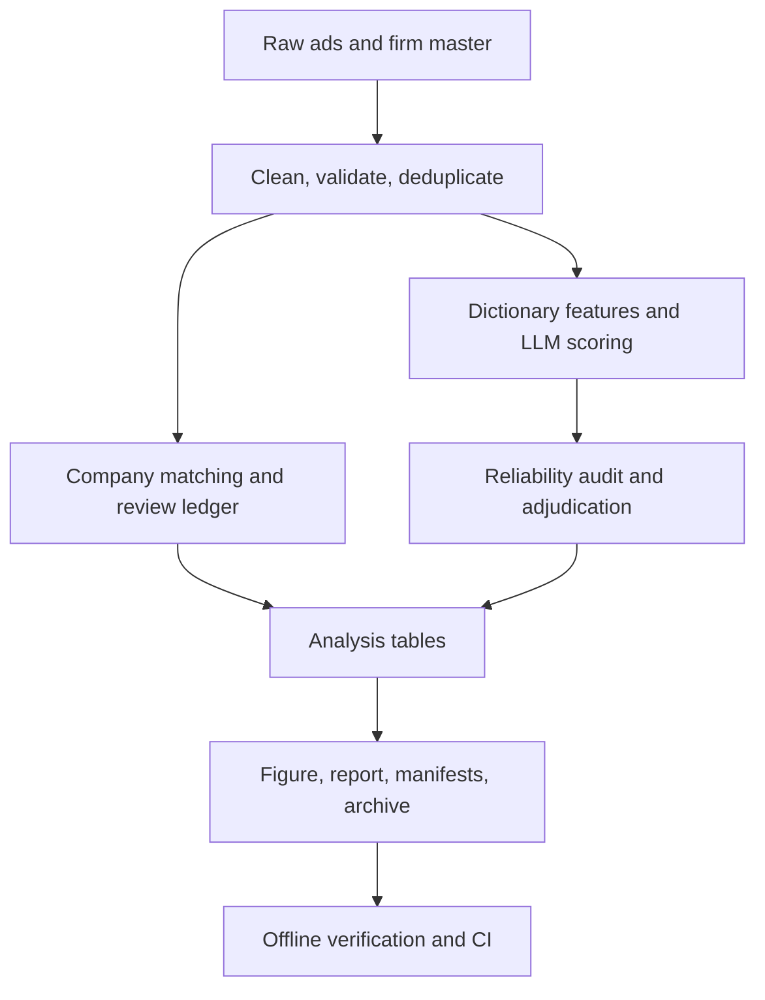

# feat: Complete RA recruitment-ad analysis

## Summary

Build a reproducible Chinese-language analysis of the supplied 51job ads: clean and deduplicate the data, link advertisers to listed parents, score AI/digital intensity with an auditable DeepSeek workflow, report annual trends and reliability, and publish every non-secret process/result artifact through GitHub.

---

## Problem Frame

The RA screening task values analytical judgment, code quality, and care with raw data. The repository currently contains only an initial README, while the local workspace contains the task specification and two raw CSV files. The final branch and pull request must let a reviewer reproduce the analysis offline from committed labels and trace every reported number to inputs, configuration, code, and review decisions.

---

## Requirements

- R1. Preserve the supplied raw files and task specification in the public repository, as explicitly authorized by the user.
- R2. Remove format tokens, parse mixed date formats, document duplicates, and retain a canonical-to-source ID map.
- R3. Match ads conservatively to listed firms, distinguish automatic from reviewed matches, and retain reasons for every unmatched case.
- R4. Assign a documented 0–3 AI/digital score using DeepSeek V4 Pro when credentials are available, with a deterministic offline fallback clearly marked as provisional.
- R5. Produce reliability diagnostics, annual shares for three thresholds, Wilson intervals, a figure, and a concise finding plus caveat.
- R6. Provide a tested CLI, offline reproducibility, Chinese README/report, lineage metadata, verification report, and submission archive.
- R7. Keep secrets and reasoning traces out of Git; publish incremental commits, an open PR, and CI results without rewriting history.

---

## Key Technical Decisions

- **Canonical deduplication:** clean all substantive fields first, then deduplicate on every field except `id`; preserve all source IDs rather than silently dropping provenance.
- **Conservative company matching:** normalized exact matches and explicit branch/parent rules may auto-match; fuzzy similarity only proposes candidates and cannot create a match without an approved alias entry.
- **Scoring scale:** 0 means no substantive digital content, 1 auxiliary digital use, 2 core software/data/automation work, and 3 explicit AI/model/advanced-algorithm work. The headline indicator is score at least 2.
- **Auditable LLM calls:** batch eight ads, validate structured JSON, cache by content hash and prompt version, retry transient failures, and never persist chain-of-thought or credentials.
- **Offline CI:** committed structured labels are the reproducibility source for CI; GitHub Actions never consumes a paid API key.
- **Public-data posture:** the user explicitly approved publishing the original CSVs even though a scan found email addresses and mobile numbers.

---

## High-Level Technical Design

---

## Implementation Units

### U1. Repository and contracts

- **Goal:** Establish package metadata, CLI contracts, configuration, CI, raw-data layout, and provenance manifests.
- **Files:** `pyproject.toml`, `src/ra_task/cli.py`, `tests/test_cli.py`.
- **Dependencies:** None.
- **Test scenarios:** CLI help succeeds; missing input paths fail clearly; offline mode never initializes an API client.
- **Verification:** A clean environment can install the locked project and discover `ra-task`.

### U2. Cleaning and deduplication

- **Goal:** Produce validated ads, valid firm rows, and duplicate mappings.
- **Files:** `src/ra_task/cleaning.py`, `tests/test_cleaning.py`, `data/processed/cleaned_ads.csv`.
- **Dependencies:** U1.
- **Test scenarios:** consecutive format tokens disappear without joining words; full-width text normalizes; timestamp and date-only values parse; near-duplicates remain distinct; dataset acceptance counts equal 612 raw, 573 canonical, 39 removed, and 5,461 valid firms.
- **Verification:** No cleaned text contains the corruption pattern and every removed ID maps to one canonical ID.

### U3. Listed-company matching

- **Goal:** Produce traceable exact, parent-rule, reviewed-alias, and unmatched outcomes.
- **Files:** `src/ra_task/matching.py`, `config/company_aliases.csv`, `tests/test_matching.py`.
- **Dependencies:** U2.
- **Test scenarios:** punctuation variants match; Ping An life/property maps to China Ping An rather than Ping An Bank; Vanke property and CMB branches map correctly; ambiguous fuzzy candidates remain unmatched.
- **Verification:** Every row has a method/confidence/status, while unmatched rows have a reason.

### U4. AI/digital scoring

- **Goal:** Implement rubric-based dictionary features, DeepSeek batching, validation, retry, cache, and offline scoring input.
- **Files:** `src/ra_task/llm_labeling.py`, `config/ai_rubric.yaml`, `tests/test_llm_labeling.py`.
- **Dependencies:** U2.
- **Test scenarios:** valid JSON passes; empty/truncated/missing/duplicate IDs and invalid evidence fail validation; 401/402 stop; 429/500/503 retry; cache resume skips completed hashes; embedded instructions in ads are treated as data.
- **Verification:** Each score has evidence, reason, confidence, model/rubric provenance, and no stored secret or reasoning trace.

### U5. Reliability and annual analysis

- **Goal:** Build the audit sample, reconcile disagreements, calculate agreement and annual estimates, and render the chart.
- **Files:** `src/ra_task/analysis.py`, `tests/test_analysis.py`, `outputs/annual_ai_share.csv`.
- **Dependencies:** U3, U4.
- **Test scenarios:** threshold counts and year denominators are correct; Wilson intervals handle zero/all positives; weighted kappa matches hand-worked examples; sample selection is deterministic and stratified.
- **Verification:** All years 2014–2025 appear with sample sizes and three reported thresholds.

### U6. Report, verification, and delivery

- **Goal:** Publish the Chinese report, all process/result ledgers, file hashes, validation summary, and submission archive.
- **Files:** `README.md`, `reports/ra_task_report.qmd`, `tests/test_pipeline.py`.
- **Dependencies:** U1–U5.
- **Test scenarios:** an offline fixture run completes; required CSV fields and unique keys validate; report sections are populated; archive excludes secrets and transient files.
- **Verification:** `ra-task verify` passes, the HTML report opens correctly, and the archive contains code, configs, data, outputs, documentation, and lock file.

---

## Risks and Dependencies

- A rotated `DEEPSEEK_API_KEY` must be supplied through the process environment for final LLM scoring; no secret will be reconstructed from chat or committed.
- The listed-firm master is the matching universe, so historical, delisted, overseas-listed, or renamed firms may remain unmatched.
- Annual observations are an uneven, non-random sample; intervals describe sampling uncertainty within this extract, not population representativeness.
- The PR remains open for user review and is not auto-merged.

