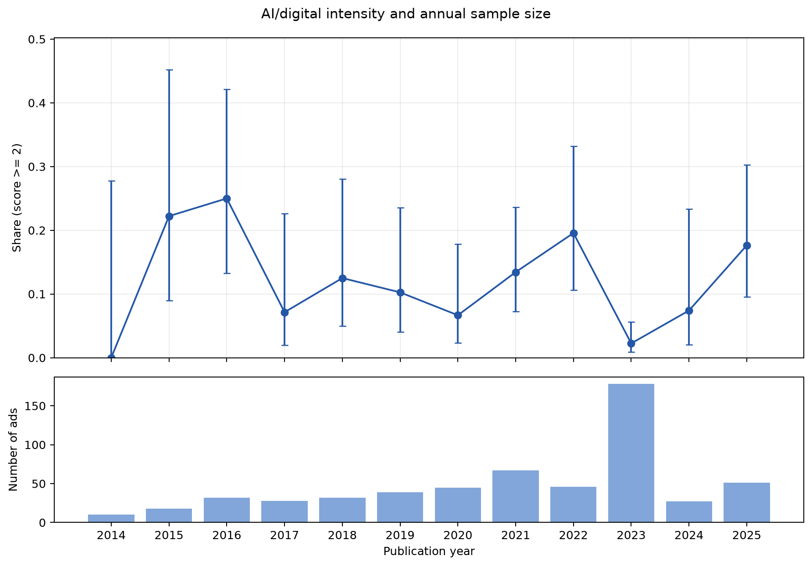

# 招聘广告中的 AI / 数字技术含量

## 数据与清洗

原始广告共 612 条。先做 Unicode NFKC 标准化、清除 `<$&数字&$>` 格式标记、压缩空白，再统一解析时间戳和纯日期。以除 `id` 外的 9 个原始业务字段完全相同作为重复判据，38 个重复组共删除 39 条，最终保留 573 条；每条的原始 ID 在 `data/interim/duplicate_map.csv` 中可追溯。公司主表原始 5463 行，按沪/深/北交所六位证券代码规则剔除 2 行脚注，保留 5461 条合法记录。

## 公司匹配

共有 538 条广告匹配到 378 家上市公司，35 条保持未匹配。处理顺序是：标准化公司全称精确匹配 → 经审核的母公司规则（平安寿险/财险、万科物业、招行分行）→ 经审核的历史曾用名。各方法数量如下：

- `exact_normalized`：358 条
- `reviewed_parent_rule`：143 条
- `reviewed_name_alias`：37 条
- `unmatched`：35 条

模糊相似度只写入 `artifacts/review/company_match_candidates.csv` 供复核，从不自动接受；所有非精确决定另见 `artifacts/review/company_match_review.csv`。实际遇到的 false positive 是：简称子串规则曾把“岭南园林股份有限公司”错配为 605303.SH“园林股份”，复核历史名后改为 002717.SZ“岭南生态文旅”；同理，“中关村科技租赁”不再因包含“中关村”而错连 000931.SZ。香港上市、已退市或无法核实母子关系的公司保持未匹配，不为提高匹配率而强行归并。

## AI / 数字技术编码

使用 DeepSeek V4 Pro 逐条阅读岗位、描述与标签，只依据广告原文编码：

- **0 分**：无实质数字技术要求；
- **1 分**：办公软件、ERP、系统录入等辅助工具；
- **2 分**：软件、数据工程、自动化等数字技术是岗位核心职责；
- **3 分**：严格 AI 研发，核心职责明确涉及 AI/机器学习模型的研发、训练、评估或部署。

金融定价模型、传统统计建模、物理仿真、控制/通信算法、大数据与 ETL 不因“模型”或“算法”一词自动进入 3 分；除非原文另外明确指向 AI/ML，它们最高为 2 分。

年度主指标为 `score >= 2`，宽松指标为 `score >= 1`，纯 AI 指标为 `score == 3`。当前标签状态：{"llm_primary": 556, "llm_adjudicated": 17}。

## 年度结果

| 年份 | 广告数 | score≥1 | score≥2（主指标） | score=3 | 主指标 Wilson 95% CI |
|---:|---:|---:|---:|---:|---:|
| 2014 | 10 | 20.0% | 0.0% | 0.0% | [0.0%, 27.8%] |
| 2015 | 18 | 50.0% | 22.2% | 0.0% | [9.0%, 45.2%] |
| 2016 | 32 | 53.1% | 25.0% | 3.1% | [13.3%, 42.1%] |
| 2017 | 28 | 50.0% | 7.1% | 0.0% | [2.0%, 22.6%] |
| 2018 | 32 | 46.9% | 12.5% | 0.0% | [5.0%, 28.1%] |
| 2019 | 39 | 56.4% | 10.3% | 0.0% | [4.1%, 23.6%] |
| 2020 | 45 | 40.0% | 6.7% | 0.0% | [2.3%, 17.9%] |
| 2021 | 67 | 47.8% | 13.4% | 0.0% | [7.2%, 23.6%] |
| 2022 | 46 | 56.5% | 19.6% | 2.2% | [10.7%, 33.2%] |
| 2023 | 178 | 36.5% | 2.2% | 0.0% | [0.9%, 5.6%] |
| 2024 | 27 | 44.4% | 7.4% | 0.0% | [2.1%, 23.4%] |
| 2025 | 51 | 60.8% | 17.6% | 0.0% | [9.6%, 30.3%] |

完整数值见 `outputs/annual_ai_share.csv`。图中上面板是主指标及 Wilson 95% 区间，下面板同时显示年度样本量，避免把小样本波动误读为稳定趋势。

## 信度检验

同一 DeepSeek 模型在不看主编码结果的条件下，开启 thinking 对 120 条广告做盲重测。样本先纳入所有低置信度、词典与模型跨主阈值冲突、以及全部严格 3 分项，再按分数分层补足；其中目标化案例 48 条。精确一致率为 85.8%，相差不超过一级的一致率为 100.0%，主阈值二分类一致率为 95.8%，二次加权 Cohen's κ 为 0.893。17 条分歧通过第三次上下文裁决请求处理，裁决请求可见两份编码及其证据。

这些指标衡量的是同一模型在不同请求与思考设置下的测试—重测稳定性，**不等同于独立人工编码者信度**。因为抽样有意富集难例，该一致率也不应直接当作 573 条广告的随机总体准确率。

## 提示词与版本敏感性

v2.1 提示词先判数字技术对象、technology_role 与 strict_ai，再由代码确定性映射分数，并加入人工开发集揭示的边界规则。v2 到 v2.1 共有 63 条分数变化，其中 11 条跨越主阈值；年度主指标的最大绝对变化为 5.1%。v2 分布为 `{"0": 303, "1": 209, "2": 59, "3": 2}`，v2.1 分布为 `{"0": 310, "1": 205, "2": 56, "3": 2}`。这一差异表明结果对构念定义和提示词有实质敏感性，因此仓库保留旧版基线、逐条对比和年度对比。

## 发现

样本中的技术型岗位并非持续平滑上升，而是随年份和招聘构成明显波动。较新的广告中出现了更多软件、数据和算法岗位，但不同阈值下幅度并不完全一致。企业数字化岗位远多于严格意义上的 AI 岗位，因此将“数字化”和“AI”拆分报告比单一二分类更有解释力。重复广告会机械放大个别公司和年份，去重后结果更适合作为主分析。

## 数据局限

这些广告不是按年份随机抽取的总体样本，且早期年份样本很少；因此年度变化可能来自行业、公司和职位构成变化，不能解释为中国上市公司整体 AI 需求的因果趋势。此外，LLM 编码尽管做了同模型盲重测和上下文裁决，仍会受量表边界、提示词版本、文本歧义和招聘文本信息不完整的影响。v2.1 已在 60 条单审核者人工开发集上调试并通过开发门槛，但锁定留出集尚未完成一次性人工评测，因此当前全量结果仍是候选版本，本项目未声称具有独立人工金标准确率。

## 可复现性

项目使用 Python、pandas、RapidFuzz、OpenAI SDK、Pydantic、NumPy、Matplotlib、pytest、uv、Quarto、Git 和 GitHub Actions。全部任务约用 4 小时（包含实现、API 编码、匹配复核、测试与报告）；单次流水线的精确起止时间见 `artifacts/manifests/run_metadata.json`。文件哈希、重复映射、匹配候选及标签来源均随仓库提交。
